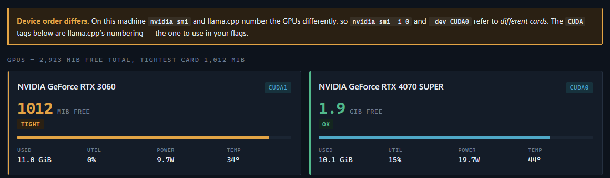
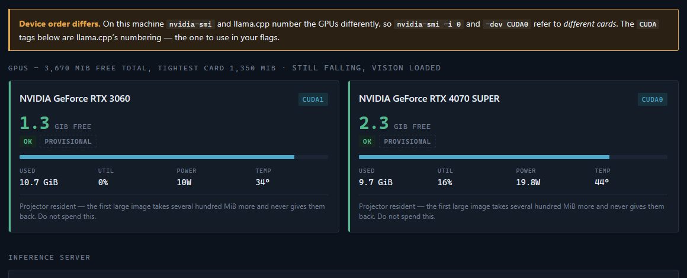
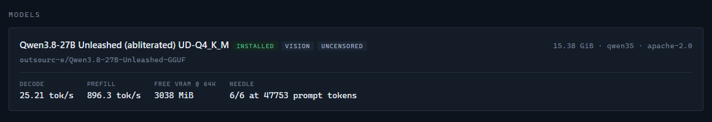

<h1 align="center">
  
</h1>

<p align="center">
  <strong>An operations console for running large language models on constrained consumer GPUs.</strong><br>
  Not another chat UI — this is for the part that actually goes wrong.
</p>

<p align="center">
  <a href="https://github.com/norkington/headroom/actions/workflows/ci.yml"></a>
  
  
  
</p>

---

## The whole problem, in one screenshot



Two things are happening there, and both of them are the point.

**2,923 MiB free "in total" is a lie.** One card has 1,012 MiB and is a browser
tab away from OOMing the server mid-generation; the other has nearly twice that.
Headroom grades every card on its own and never on the sum.

**`nvidia-smi -i 0` and `-dev CUDA0` are different cards on this machine.** NVML
enumerates by PCI bus; llama.cpp uses the CUDA runtime's FASTEST_FIRST order.
When they disagree, every tuning decision made from the wrong card is wasted.
Headroom reconciles them against llama.cpp's own `--list-devices` and says so
loudly.

> **Status: early.** Working end to end on real hardware, but the API is not
> stable yet. NVIDIA-only for now.

---

## What it does

| | |
|---|---|
| **Grades VRAM per card, live** | 1 Hz SSE stream. Totals never decide a colour. |
| **Reconciles CUDA ↔ NVML order** | Detects when `-dev CUDA0` and `nvidia-smi -i 0` name different cards. |
| **Judges a quant before you download it** | Reads a remote GGUF's tensor table over a ranged request — 24 MiB to assess 15 GiB. |
| **Starts, attaches to and stops llama-server** | Spawned *detached*. Closing the UI never unloads your model. |
| **Benchmarks the running model** | Warm-up discarded, prefill measured separately, results written back to your registry. |
| **Finds your context ceiling** | Tries real loads until it finds the largest context that still leaves every card above a margin. |
| **Flags thermal throttling** | Graded against each card's own slowdown threshold, and recorded against any benchmark that ran while it was happening. |
| **Resumable downloads** | Stall-detecting, and they survive a restart of the backend. |

If you want chat, use Open WebUI, LM Studio, Jan or KoboldCpp — they are good at
it. What none of them do well is treat **the hardware as the thing you are
operating**.

---

## Vision is a different operating point, and it says so



Both cards read `ok`. Both are also marked **provisional**, because llama.cpp's
image buffer is a *retained high-water mark*, not a transient: it grows the first
time a large image is processed and is never given back for the life of the
server. One 4K image took a card here from 578 MiB free to 170 MiB and left it
there.

So the figure above is an upper bound, not a reading. The grade is deliberately
**not** demoted for it — `ok` still means what it measures, and flattening a
1.3 GiB card into the same bucket as a 600 MiB one would lose the distinction
that decides whether that first image is survivable at all. What changes is that
the number is labelled unfinished, so it is not mistaken for spare capacity.

A card that is thermally throttling is flagged the same way, and graded against
**its own** slowdown threshold rather than a fixed temperature — the two cards
here clamp at 95 °C and 96 °C, so any hardcoded number would be wrong on at least
one of them. Throttling outranks the reading, because a clamped card *cools* while
its throughput collapses. A benchmark that ran while it was happening says so:
those figures measured the cooling as much as the model.

---

## Is this quant worth 15 GiB of download?

Paste a repo, pick a file, get an answer in seconds — without downloading it.

```console
$ curl -s '127.0.0.1:7315/api/probe?repo=outsourc-e/Qwen3.8-27B-Unleashed-GGUF&file=Qwen3.8-27B-Unleashed-UD-Q4_K_M.gguf'
```

```jsonc
{
  "architecture": "qwen35",
  "size_gib": 15.38,
  "bytes_read": 25165824,        // 24 MiB read to judge a 15.38 GiB file
  "tensor_count": 866,
  "has_mtp": true,
  "families": {
    "recurrent":    { "F32": 192, "Q8_0": 96, "Q5_K": 33, "Q6_K": 5, "IQ4_XS": 5, "Q4_K": 5 },
    "attention":    { "F32": 99, "Q4_K": 60, "Q5_K": 37, "Q6_K": 30, "IQ4_XS": 26, "Q8_0": 10 },
    "feed_forward": { "IQ4_XS": 85, "Q5_K": 50, "Q4_K": 38, "Q3_K": 7, "Q6_K": 5, "IQ3_S": 4 }
  },
  "findings": [
    { "level": "good",    "title": "Speculative decoding head present" },
    { "level": "good",    "title": "Recurrent layers are protected" },
    { "level": "caution", "title": "Will not fit in free VRAM" }
  ]
}
```

Why the tensor table and not the file size: on hybrid architectures (Qwen3.5+
and friends) most blocks are **recurrent**, and quantization error in a recurrent
layer *accumulates with context depth* while feed-forward error does not compound.
Two builds of the same model at the same size can differ a lot, and the
difference is visible only here. This one keeps 101 of 144 quantized recurrent
tensors at high precision — it will hold up at long context where an all-Q4_K
build of identical size degrades.

That last finding is live rather than static: those weights do not fit *right
now*, because the card is already holding a model.

Vision projectors are listed apart from the quants rather than alongside them.
Both are `.gguf`, and a projector picked as a model fails at load rather than at
the point you chose it.

---

## How big a context does this machine actually hold?

Your registry records a context length. Nothing verifies it — and on the machine
this was built on, the recorded 64K turned out to leave the tightest card at
**1,012 MiB free**, below the very threshold the GPU panel grades as *tight*.

```console
$ curl -s -X POST '127.0.0.1:7315/api/ceiling/start?model=qwen38-unleashed'
```

```
ctx  65,536   13.4s   free  1012 MiB   loaded, below margin
ctx  32,768   13.6s   free  2068 MiB   within margin
ctx  59,392   13.6s   free  1210 MiB   within margin   <- ceiling
```

Three real loads, 40 seconds. Each candidate is **started, waited for, measured
and stopped** — because KV arithmetic is close but it is not the whole
allocation, and what the rest of it produces is a server that exits during
startup rather than a number that comes out slightly high.

The target is deliberately *not* the largest context that loads. A context that
fits with 200 MiB to spare is one browser tab away from an OOM mid-generation,
which is the failure this whole project exists to prevent. So the search looks
for the largest context that still leaves **every** card above a margin, and the
margin defaults to the same threshold the GPU panel grades against — the answer
agrees with the colour you are already looking at. Pass `?margin_mib=` to move it.

If your registry records `kv_bytes_per_token` it seeds the first step, which
typically halves the number of loads. It is only a seed: two real probes replace
it with a slope measured on your hardware, so a stale or wrong value costs time
rather than correctness. Note that a recorded figure is a *total* while what
binds is *per card* — on a two-card split the observed slope here was 0.0322
MiB/token against a recorded 0.0625.

**Nothing is written to your registry.** A benchmark observes the configuration
you have, so recording it is bookkeeping. A ceiling search proposes a *different*
one, and that is a decision rather than a measurement — so it hands you the
evidence and stops. It also refuses to run while a server is up, because it
cycles llama-server repeatedly and will not unload a model you are using.

---

## Measurements are reported honestly, or not at all



An entry added through the UI arrives marked **NOT MEASURED** — every serve value
in it is a template default or a guess copied from a sibling build. Benchmarking
replaces those numbers, and it plays by rules that each exist because a confident
answer turned out to be wrong:

- **Warm-up runs are discarded.** One observed sequence climbed 19.61 → 27.03 →
  30.33 before settling near 30. Averaging those in reports a slow model.
- **Prefill gets its own stage with a long prompt.** At ~40 tokens,
  `prompt_per_second` measures per-request overhead: it produced 54.9 tok/s with
  a standard deviation *larger than the mean*, against a true ~895 on the same box.
- **Every prefill rep gets a unique nonce.** Identical prompts are served from
  the server's cache, silently collapsing a three-run sample to one.
- **Decode is never recorded without its spread and its accept rate**, because
  decode moves with speculative-decoding acceptance, and a bare figure invites
  reading a task difference as a regression.

The entry being measured is resolved from the file the **running server actually
loaded**, never from what the UI has selected — Headroom attaches to servers it
did not start, so the two genuinely differ. An unregistered file is refused
rather than guessed at.

---

## Design principles

**Nothing leaves your machine.** Loopback only. No accounts, no telemetry, no
cloud dependency. The only outbound traffic is downloading weights you asked for.

**Headroom never owns your inference server.** `llama-server` is spawned
*detached* and Headroom *attaches* to it, discovering state from `/props` and the
process command line. Closing the UI leaves your model resident — reloading 15
GiB costs minutes, and no dashboard should be able to cost you that by being
closed.

**Your config file is the source of truth.** Headroom reads and writes the same
registry your scripts use. Writes are atomic, take a backup, refuse to clobber
existing keys, and round-trip your comments untouched. Two sources of truth is
how a CLI and a GUI drift into disagreeing about what is running.

**Work in progress outlives the process.** Downloads and benchmarks are written
to disk as they change, so a transfer that was in flight comes back
**interrupted** with a Resume button instead of leaving a nameless 9 GiB `.part`
file. Neither restarts on its own — what comes back is a record, and picking it
up again is your decision. An interrupted benchmark comes back with **no
figures**: a run cut short measured the part of the workload it reached, which is
exactly what the warm-up and prefill rules say to discard.

---

## Running it

```bash
git clone https://github.com/norkington/headroom
cd headroom
uv venv
uv pip install -e ".[dev]"

cd web && npm install && npm run build && cd ..

headroom
```

UI and API from a **single process** on <http://127.0.0.1:7315>. The frontend
builds into `src/headroom/static/`, which is what makes it ship inside the wheel
rather than being left behind by `pip`.

**Requirements:** Python 3.11+, an NVIDIA GPU with a working driver (NVML), and
[`llama.cpp`](https://github.com/ggml-org/llama.cpp) built with `llama-server`.

### It should work with no configuration

On first run Headroom finds `llama-server` on your `PATH` (or a conventional
build location) and creates an empty registry under your platform's data
directory. Where each path came from is reported at startup and by
`/api/health`, because "found nothing" and "found the wrong thing" need different
fixes and look identical otherwise.

Anything it gets wrong can be overridden, highest priority first:

```bash
headroom --registry /path/to/models.json --llama-server /path/to/llama-server
```

```bash
HEADROOM_REGISTRY=... HEADROOM_LLAMA_SERVER=... headroom
```

Or persist it in `config.toml`, in your platform config directory (the exact path
is printed by `/api/health`):

```toml
[paths]
registry = "/path/to/models.json"
llama_server = "/path/to/llama-server"
```

Without `llama-server`, probing, telemetry and registry editing all still work —
only starting a model needs it, and the app says so rather than failing silently.

### The command line it builds

Starting a model generates the flags from your registry entry. The vision profile
is a genuinely different operating point, so note the context and the tensor
split, not just the added projector:

```console
llama-server -m .../Qwen3.8-27B-Unleashed-UD-Q4_K_M.gguf \
  --ctx-size 32768 -ngl 99 -fa on -ub 512 -b 2048 -np 1 --cache-ram 32768 \
  -ctk q8_0 -ctv q8_0 --host 127.0.0.1 --port 8080 \
  -dev CUDA0,CUDA1 -ts 0.44,0.56 --jinja \
  --spec-type draft-mtp \
  --mmproj .../mmproj-Unleashed-f16.gguf --image-min-tokens 1024
```

`test_argv_parity.py` asserts this matches what a real shell launcher's own
dry-run prints, so the two cannot drift.

### Working on the frontend

```bash
npm run dev    # in web/ -- port 7316, proxies /api to the backend on 7315
```

Run `headroom` alongside it for the API.

### Tests

```bash
uv run pytest
uv run ruff check src tests
uv run ruff format --check src tests
```

`test_units.py`, `test_bench.py` and `test_persistence.py` are portable and run
anywhere. `test_argv_parity.py` checks the generated command line against a real
shell launcher's own dry-run output, so it needs one — and skips cleanly, saying
which paths it looked for, when there isn't one. Point it at yours with:

```bash
HEADROOM_PARITY_REGISTRY=/path/to/models.json HEADROOM_PARITY_LAUNCHER=/path/to/serve.ps1 uv run pytest
```

---

## Licence

MIT — see [LICENSE](LICENSE).
